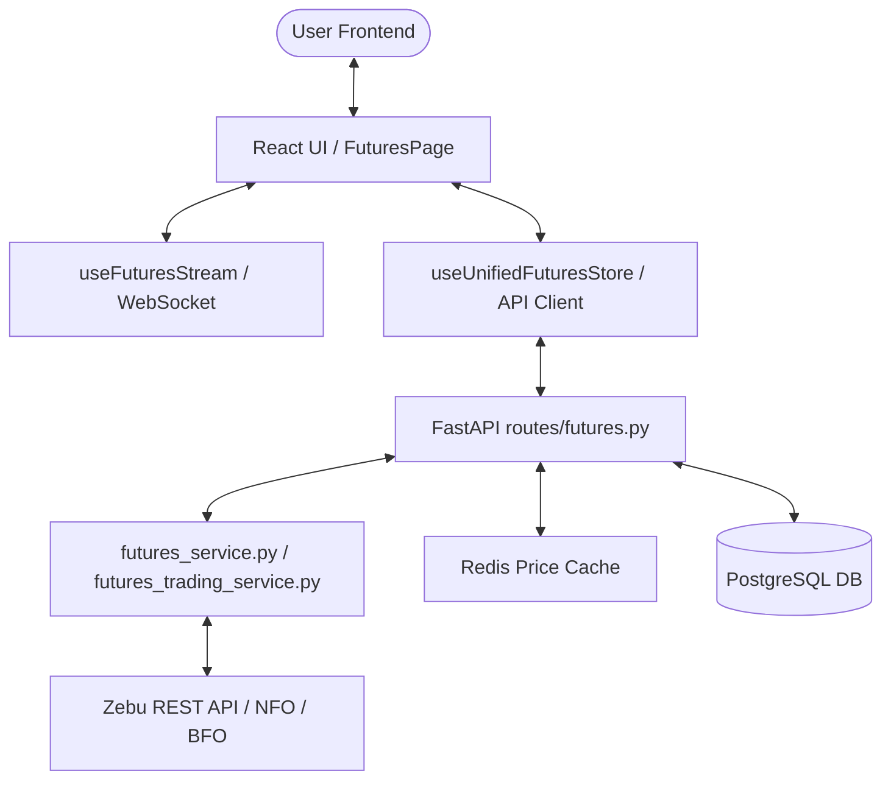

# Detailed Architectural Report: Futures Workspace

This document provides a comprehensive technical overview of the **Futures Workstation** architecture within the AlphaSync platform. It covers frontend structures, backend routes, databases, caching models, and live market streaming pipelines.

---

## 1. Workstation Overview & Capabilities

The **Futures Workstation** is a terminal-grade environment for monitoring and paper-trading index and equity futures contracts. It includes contract lists, basis spread metrics, TradingView charting, real-time depth, and a drag-and-drop order panel.



---

## 2. Frontend Architecture & Components

The frontend layout is built with React 18, utilizing Vite for fast bundling.

### Key Components (`frontend/src/components/futures/` & `trading/`)
1. **`FuturesPage.jsx`**: The main layout coordinator. Splits the layout into: Watchlist Sidebar (Left), Chart and Dock (Center), and Futures Intelligence/Analytics Sidebar (Right).
2. **`FuturesWatchlist.jsx`**: Displays a custom watchlist of tracked futures contracts. Allows users to switch between contract months (Near, Mid, Far) and shows live quotes, percent changes, and open interest (OI).
3. **`ZebuLiveChart.jsx`**: Draws a TradingView Lightweight Chart mapping historical candles. Ticks streamed from the active WebSocket session automatically patch the last candle in real-time.
4. **`FuturesChartHeader.jsx`**: Displays the active contract symbol, current LTP, daily net change, day high/low, open interest, and the contract basis (futures price minus underlying spot price).
5. **`OrderPanel.jsx`**: Drag-and-drop floating panel enabling users to enter paper-trading trades (market, limit, stop-loss orders).
6. **`FuturesFooterStatus.jsx`**: Displays real-time connection status of the Zebu streaming provider.

### State Stores
- **`useUnifiedFuturesStore`**: Controls the active workspace selection, active contract month (Near/Mid/Far), positions, and active orders.
- **`useFuturesWatchlistStore`**: Manages the custom watchlist items stored in the PostgreSQL database.

---

## 3. Backend Architecture & Route Schemas

The backend endpoints are defined in `backend/routes/futures.py` and `backend/routes/futures_watchlist.py`.

### Route Mappings (`/api/futures`)

#### 1. `GET /contracts/{symbol}`
Lists available futures contracts for an underlying symbol (e.g. RELIANCE, NIFTY).
*   **Response Structure**:
    ```json
    {
      "symbol": "RELIANCE",
      "found": true,
      "contracts": [
        {
          "contract_symbol": "RELIANCE26JUL09FUT",
          "token": "54231",
          "exchange": "NFO",
          "expiry_date": "2026-07-09",
          "expiry_label": "Near",
          "days_to_expiry": 3,
          "lot_size": 250,
          "tick_size": 0.05,
          "instrument_type": "FUTSTK"
        },
        ...
      ]
    }
    ```

#### 2. `GET /quote/{contract_symbol}`
Fetches the live quote (LTP, bid/ask depth, open interest) for a contract.
*   **Fast Path**: Checks Redis cache first. If a fresh quote is cached (`alphasync:price:{symbol}`), it is returned in `<2ms`.
*   **Slow Path**: Queries Zebu `/GetQuotes` API using the contract's token.

#### 3. `GET /history/{contract_symbol}`
Fetches historical candles for sparklines and TV charts.
*   **Caching**: Uses the newly isolated Redis chart cache namespace `alphasync:chart_history_cache:*` with a 5-minute TTL to keep charts fast while preventing worker tick collisions.

#### 4. `GET /spot/{symbol}`
Gets the underlying spot price (e.g. `^NSEI` for `NIFTY` futures) to calculate the contract basis spread:
$$\text{Basis} = \text{Futures Price} - \text{Spot Price}$$

#### 5. Trading Endpoints (`POST /order`, `POST /cancel`, `GET /positions`)
Bridges to `futures_trading_service.py` to handle virtual/paper trading account positions, ledger balances, and order logs stored in PostgreSQL.

---

## 4. Caching & Data Flow Policies

1. **Redis Cache-Aside**: Quotes fetched from Zebu are saved in Redis with a TTL matching the trading status:
   - 120 seconds during market hours.
   - 86,400 seconds (1 day) when the market is closed or on holiday.
2. **Chart History Cache Isolation**: Chart historical data is cached in `alphasync:chart_history_cache:{symbol}:{period}:{interval}`. This ensures that the background tick-accumulation worker (which builds short live candle buffers) never corrupts the full historical candles fetched from Zebu REST API.
3. **Database Watchlist Persistence**: User watchlists are stored persistently in PostgreSQL `watchlist_items` and loaded on backend startup.
