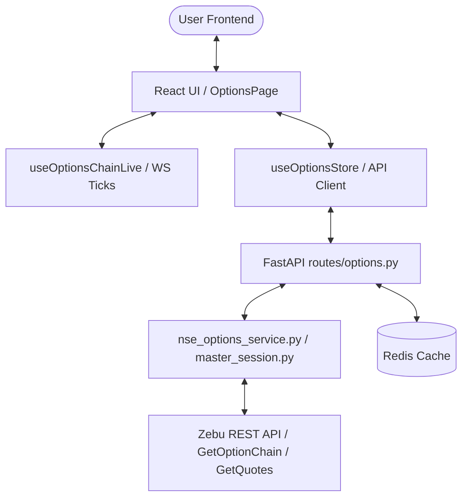

# Detailed Architectural Report: Options Workspace

This document provides a comprehensive technical overview of the **Options Workstation** architecture within the AlphaSync platform. It covers frontend interfaces, backend route handlers, data schemas, caching models, and real-time streaming integrations.

---

## 1. Workstation Overview & Capabilities

The **Options Workstation** is a premium dashboard designed for derivative trading and analytics. It features a compact option chain, TradingView lightweight charting pane, real-time metrics, Greek indicators, and an integrated order placement panel.



---

## 2. Frontend Architecture & Components

The frontend is built on React 18 and Vite. It is hosted as an SPA (Single Page Application) proxying `/api` queries to the backend.

### Key Components (`frontend/src/components/options/`)
1. **`OptionsPage.jsx`**: The root layout coordinator. Organizes the screen into three main sections: Watchlist/Option Chain (Left), Chart and Dock (Center), and Strike Details/Greeks (Right).
2. **`OptionChainCompact.jsx`**: A grid component that displays Calls (CE) and Puts (PE) side-by-side centered around the At-The-Money (ATM) strike. Highlights:
   - Color coding for In-The-Money (ITM) strikes.
   - Live updates for Last Traded Price (LTP), Change (%), and Volume.
3. **`ZebuLiveChart.jsx`**: Fuses historical candles fetched via REST with live ticks streamed over WebSockets to draw an auto-updating TV Lightweight Chart.
4. **`OptionsChartHeader.jsx`**: Renders the header toolbar above the chart, displaying the underlying spot price (e.g. NIFTY spot), chosen interval, indicators selector, and a floating order ticket switch.
5. **`OptionsOrderPanel.jsx`**: A terminal-grade draggable floating order entry widget allowing users to select buy/sell side, lots/quantity, and order type (MARKET/LIMIT/SL) for option contracts.
6. **`OptionsStrikeDetailsPanel.jsx`**: Shows key metrics for the selected option strike including Delta, Gamma, Theta, Vega, Implied Volatility (IV), and open interest changes.
7. **`OptionsBottomDock.jsx`**: Displays collapsible tabs for active Option Positions, filled Orders, and daily Trades.

### State Management & Lifecycle Hooks
- **`useOptionsStore`**: Manages state for positions, order fills, executions, and active strategies.
- **`useOptionsChainLive`**: Subscribes the client's session to real-time option ticks. When a new tick arrives from the WebSocket connection, this hook merges the new price into the option chain grid.
- **`optionsWsBridge.js`**: Bridges global websocket message events (`PRICE_UPDATED`) to local option chain rows.

---

## 3. Backend Architecture & Route Schemas

The backend endpoints are implemented in `backend/routes/options.py`. All Zebu interactions go through active Zebu sessions managed by `BrokerSessionManager`.

### Routes Map (`/api/options`)

#### 1. `GET /underlyings`
Returns list of supported underlying index symbols.
*   **Response Structure**:
    ```json
    {
      "underlyings": [
        {"symbol": "NIFTY", "name": "Nifty 50", "exchange": "NSE"},
        {"symbol": "BANKNIFTY", "name": "Bank Nifty", "exchange": "NSE"},
        ...
      ]
    }
    ```

#### 2. `GET /expiry/{symbol}`
Fetches active expiry dates for a selected underlying index/stock.
*   **Process**:
    1. Looks in Redis cache (`options:expiry:{symbol}`).
    2. If cache miss, queries Zebu `/SearchScrip` for option contracts, parses `exd` fields, sorts them nearest-first, and saves to Redis for 5 minutes (300s).

#### 3. `GET /chain/{symbol}`
Slices the live option chain centered around the underlying's spot price.
*   **Query Params**:
    - `expiry`: ISO string (e.g. `2026-07-09`)
    - `strikes`: Count of strikes to fetch above/below ATM (defaults to 20)
    - `snapshot`: Return cached Redis snapshot only (progressive loading)
    - `reconcile`: Trigger background thread Zebu fetch for EOD reconcile
*   **Process**:
    1. Resolves underlying spot price (checks Redis tick quote or Zebu future proxy).
    2. Dynamically downloads and extracts Zebu's 20MB+ compressed NFO/BFO contract master mapping zip from the CDN (`https://go.mynt.in/NFO_symbols.txt.zip`).
    3. Parses option leg tokens matching expiry & strike bounds.
    4. Issues parallel `/GetQuotes` calls (with semaphore throttling) to Zebu.
    5. Returns unified Call-Put strike rows.

#### 4. `GET /history`
Retrieves historical OHLCV candles for options.
*   **Process**: Uses Zebu `/TPSeries` for intraday intervals and `/EODChartData` for daily candles based on direct `token` + `exchange` lookup.

#### 5. `POST /promote-hot`
Promotes option legs in the active viewport to `HOT` priority tier inside `SymbolPriorityEngine` to bypass global throttling queues and stream ticks at maximum frequency.

---

## 4. Data Architecture & Field Schemas

### Options Chain Leg Schema
Each leg (CE/PE) in the chain carries the following normalized properties:
```json
{
  "strike": 24200.0,
  "expiry": "2026-07-09",
  "option_type": "CE",
  "tsym": "NIFTY26JUL0924200CE",
  "token": "43251",
  "ltp": 142.50,
  "change": -12.45,
  "change_percent": -8.03,
  "volume": 128400,
  "oi": 432000,
  "oi_change": 12000,
  "bid": 142.35,
  "ask": 142.60,
  "iv": 14.25,
  "delta": 0.521,
  "gamma": 0.0014,
  "theta": -18.25,
  "vega": 2.45
}
```

---

## 5. Cache Policies & Performance Optimizations

1. **Contract Master Cache**: The Zebu contract master file is downloaded once per day. The parsed JSON tree mapping expiry dates to strikes is saved in Redis for 6 hours (`options:contracts:{exchange}:{symbol}`) to avoid redownloading 20MB+ zips on every API request.
2. **Progressive Option Chain Hydration**:
   - The UI makes a fast request with `snapshot=1`.
   - The backend returns the cached Redis snapshot in `<5ms`.
   - While the UI displays the snapshot, a background call with `reconcile=1` queries the Zebu API for fresh quotes, updates the Redis cache, and streams the reconciled values back to the UI.
3. **Throttling Protection**: Option quotes fetched from Zebu that contain all-zero LTP/Quotes are ignored for caching to prevent poisoning Redis with invalid/broken EOD values.
